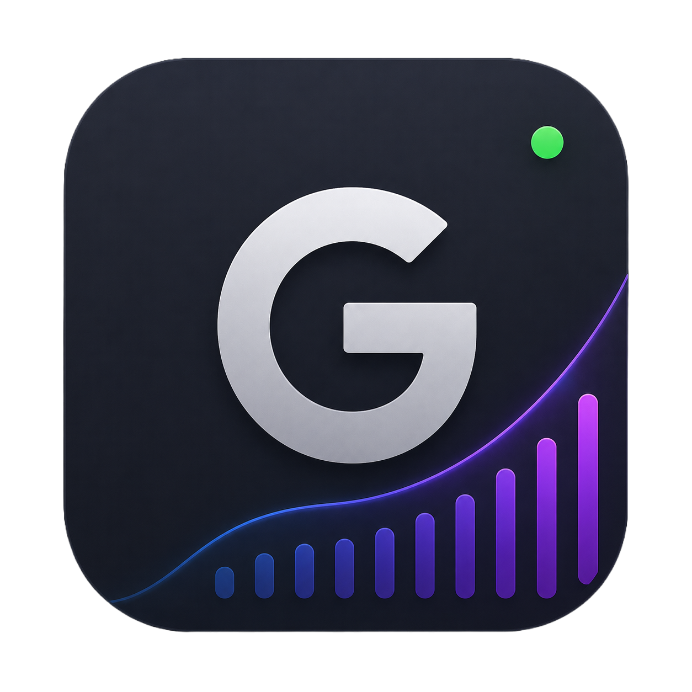

<p align="center">
  
</p>

<h1 align="center">Glance</h1>

<p align="center">
  <strong>A native macOS desktop dashboard for developers.</strong><br/>
  GitHub activity, Docker containers, and SSH servers — all in one glance.
</p>

<p align="center">
  <a href="https://github.com/veyselaksin/glance/actions/workflows/ci.yml"></a>
  <a href="https://github.com/veyselaksin/glance/releases/latest"></a>
  <a href="https://github.com/veyselaksin/homebrew-tap"></a>
  <a href="#"></a>
  <a href="#"></a>
  <a href="#"></a>
  <a href="./LICENSE"></a>
</p>

<p align="center">
  Built with <a href="https://wails.io">Wails</a> (Go backend + React/TypeScript
  frontend) and tuned for macOS: transparent titlebar with floating traffic
  lights, vibrancy, and a dark, material-inspired UI.
</p>

---

> **Glance** — *see* what matters, skip the rest. Your GitHub commits, local
> Docker fleet, and SSH boxes, surfaced on a single, quiet dashboard that
> actually feels like it belongs on a Mac.

## Features

- **Overview** — a single screen combining today's GitHub activity, local
  Docker status, and your primary server's health.
- **GitHub** — today's contributions and commit count, authenticated via
  GitHub's [Device Flow](https://docs.github.com/apps/building-oauth-apps/authorizing-oauth-apps/#device-flow)
  (no client secret, no password ever stored). The token is kept locally in
  `config.json`.
- **Docker** — list containers with state, status, CPU and memory usage;
  stream logs, start / stop / delete containers; talks to your local Docker
  socket.
- **Servers** — save SSH-reachable hosts (password or private-key auth),
  open an in-app terminal ([xterm.js](https://xtermjs.org)), and pull live
  server metrics (CPU / memory / disk). Private keys are stored in a
  dedicated key directory, never inline in the config.
- **Server ping** — ICMP and HTTP health checks for any host.
- **Docs** — built-in reference for the bundled commands and conventions.

## 🚀 Installation

You can easily install Glance on macOS using **Homebrew**. Thanks to our automated custom Tap, you don't need to worry about manual downloads or macOS Gatekeeper permission prompts.

Run the following commands in your terminal:

```bash
# 1. Add the custom Homebrew tap
brew tap veyselaksin/tap

# 2. Trust the tap (Required for custom third-party taps)
brew trust veyselaksin/tap

# 3. Install Glance as a macOS Cask
brew install --cask glance
```

## Requirements

- macOS 12 or newer (the UI is tuned for Mac; Linux/Windows builds are
  possible with Wails but untested here)
- [Go](https://go.dev) 1.25+
- [Node.js](https://nodejs.org) 18+ with npm
- The [Wails CLI](https://wails.io/docs/gettingstarted/installation): `go install github.com/wailsapp/wails/v2/cmd/wails@latest`
- Docker (only if you want the Docker tab to talk to a local daemon)

## Getting started

```bash
git clone https://github.com/veyselaksin/glance.git
cd glance
wails dev
```

`wails dev` runs a Vite dev server with hot reload for the frontend. A second
dev server at <http://localhost:34115> lets you call the bound Go methods
from browser devtools.

## Building

To produce a redistributable, production-mode bundle:

```bash
wails build
```

The output binary lands in `build/bin/`. For a macOS `.app` bundle use
`wails build -platform darwin/universal`.

## Project structure

```
main.go              Wails entrypoint; window + macOS options
app.go               Backend logic: GitHub, Docker, server ping, config
ssh.go               SSH connections, key storage, server metrics
frontend/
  src/
    App.tsx          Main UI, Docker table, overview
    ServersView.tsx  SSH server management + terminal
    SignInPage.tsx   GitHub Device Flow sign-in
  wailsjs/           Generated bindings to the Go backend
build/               Platform packaging assets (appicon, Info.plist)
```

## Configuration

On first launch Glance writes a `config.json` to your user data directory
(`~/Library/Application Support/Glance` on macOS). It stores:

- `github_username`, `github_token` — your signed-in GitHub identity
- `client_id` — optional override for the embedded OAuth Client ID (see below)
- `server_host` — the host shown on the overview dashboard
- `servers` — saved SSH servers (passwords are kept here; private keys live
  in the key directory)
- `docker_socket` — path to the Docker socket, defaults to the system one

## Security notes

- **GitHub OAuth**: the embedded `DefaultClientID` in `app.go` is a *public*
  identifier only — the Device Flow does not use a client secret, so it is
  safe to ship in an open-source binary. Forks that want their own branding
  on the authorization screen can create their own OAuth App and either
  change the constant or override it per-user via `client_id` in
  `config.json`.
- **SSH credentials**: passwords are stored in `config.json`; private keys
  are written to a dedicated, access-restricted key directory and referenced
  by path. Anyone with read access to these files can impersonate your
  servers — protect them accordingly.
- **GitHub token**: stored in plaintext in `config.json`. If you don't want
  that, sign out from the GitHub tab to clear it.

## Tech stack

- Backend: Go 1.25, Wails v2.12
- Frontend: React 18, TypeScript, Vite, Tailwind CSS, xterm.js
- Integrations: GitHub REST/GraphQL API, Docker Engine API, golang.org/x/crypto/ssh

## Contributing

Contributions are welcome. Please open an issue first for non-trivial changes
so we can align on direction before you spend time on a PR.

## License

[MIT](./LICENSE) © Veysel Aksin
